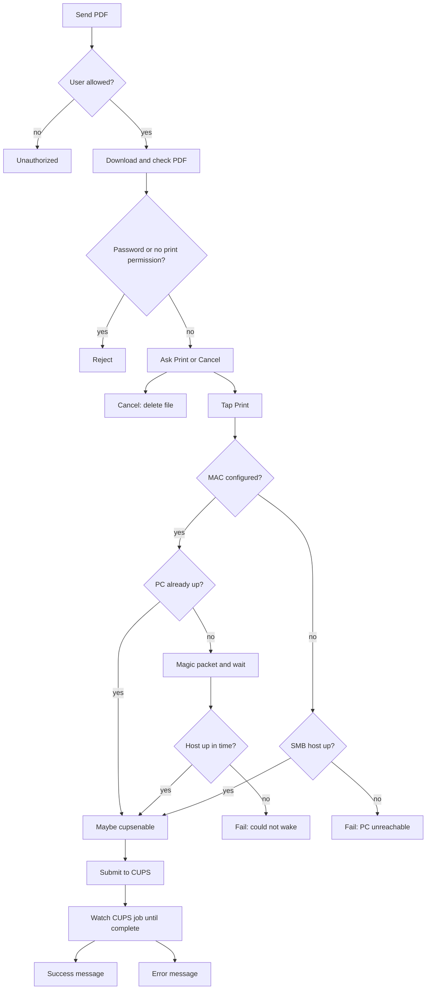

# Telegram Print Bot

A Telegram bot that receives PDFs and images, asks for confirmation, and sends them to a **CUPS** printer (`lp`).

## Prerequisites

- **Python 3.14+**
- **[uv](https://docs.astral.sh/uv/)** (recommended) or another way to create a virtualenv and install dependencies
- A Telegram bot token from [@BotFather](https://t.me/BotFather)
- System tools used at runtime:
  - **CUPS:** `lp` (`cups-client` on Debian/Ubuntu)
  - **PDF checks:** handled in Python via `pikepdf` (no extra system packages)

On Debian/Ubuntu:

```bash
sudo apt install cups-client
```

## Installation

1. Clone or copy the project to a directory (e.g. `/opt/telegram-print-bot`).

2. Create the virtual environment and install dependencies with uv:

```bash
cd /opt/telegram-print-bot
uv sync
```

This creates `.venv/` and installs packages from `pyproject.toml`.

3. Create your configuration file from the example:

```bash
cp config.env.example config.env
chmod 600 config.env
```

4. Edit `config.env` with your values (see [Configuration](#configuration) below).

5. (Optional) Test manually before enabling systemd:

```bash
set -a && source config.env && set +a
.venv/bin/python bot.py
```

Stop with `Ctrl+C` once you confirm the bot starts and responds in Telegram.

## Configuration

Variables are read from the process environment. When run under systemd, they are loaded from `config.env` via `EnvironmentFile`.

### Mandatory variables

| Variable | Description |
|----------|-------------|
| `TELEGRAM_BOT_TOKEN` | Bot token from BotFather. The bot refuses to start without it. |
| `ALLOWED_USER_IDS` | Comma-separated Telegram user IDs allowed to print (e.g. `123456789,987654321`). Get your ID from [@userinfobot](https://t.me/userinfobot). Users not in this list are rejected. |

You must also configure a CUPS queue:

| Variable | Description |
|----------|-------------|
| `PRINTERS` | Comma-separated CUPS queue names (see `lpstat -p` or `lpstat -a`). Any authorized user can pick one with `/printer`; that choice applies to **everyone**. |
| `DEFAULT_PRINTER` | Queue used until someone runs `/printer`. Defaults to the first name in `PRINTERS`. Must be one of the listed names. |

### Optional: Wake-on-LAN

If a Windows PC that **shares** the printer is often asleep, the bot can send a magic packet when you tap **Print**, wait until the host is reachable, then submit the job. This only helps for a **wired** Ethernet NIC on that PC. A printer with its own IP does not need this — print to the printer instead.

| Variable | Description |
|----------|-------------|
| `WOL_MACS` | Ethernet MAC of the PC to wake. See formats below. |
| `WOL_HOSTS` | IP/hostname used to detect that the PC is up (TCP 445 / 139, then ping). Same formats as `WOL_MACS`. If omitted, the bot uses the CUPS device URI (`lpstat -v`). |
| `WOL_BROADCAST` | Destination for the magic packet. Default `255.255.255.255`. Some networks need the subnet broadcast, e.g. `192.168.1.255`. |
| `WOL_PORT` | UDP port (default `9`). Packets are also sent to port `7`. |
| `WOL_WAIT_SECONDS` | How long to wait for the PC after the packet (default `90`). |
| `WOL_POLL_SECONDS` | Seconds between reachability checks (default `3`). |
| `WOL_READY_GRACE_SECONDS` | Extra wait after the host answers, so SMB/the spooler can finish starting (default `8`). |

`WOL_MACS` and `WOL_HOSTS` accept **either** positional CSV **or** `name=value` pairs. Do not mix the two in the same variable (the bot refuses to start).

**CSV**, same order as `PRINTERS`. Leave a slot empty (nothing between commas) to skip that printer — no MAC and no IP, so no Wake-on-LAN for a local USB queue:

```env
PRINTERS=ufficio,locale,sala
WOL_MACS=AA:BB:CC:DD:EE:FF,,11:22:33:44:55:66
WOL_HOSTS=192.168.1.10,,192.168.1.30
```

**Names with `=`**, matching a name in `PRINTERS`. Omit a printer entirely to skip it (same effect as an empty CSV slot):

```env
PRINTERS=ufficio,locale,sala
WOL_MACS=ufficio=AA:BB:CC:DD:EE:FF,sala=11:22:33:44:55:66
WOL_HOSTS=ufficio=192.168.1.10,sala=192.168.1.30
```

A trailing comma also skips the last name (`WOL_MACS=AA:BB:CC:DD:EE:FF,` wakes only the first printer). A name that is not in `PRINTERS` is ignored (warning in the log).

On the Windows PC:

1. BIOS: enable Wake on LAN / PME.
2. Device Manager → the **Ethernet** adapter → Power Management: allow the device to wake the computer, and only with a magic packet.
3. Adapter advanced properties: **Wake on Magic Packet** = Enabled.
4. Use **Sleep**, not Hibernate or Shut down. Hibernate usually will not wake.
5. The bot machine must be on the same LAN (broadcast must reach the PC).

When WoL is configured and the host is down, Telegram shows “Waking the PC…” before “Sending…”. If the host never answers, the print is aborted instead of sitting in CUPS.

### Example `config.env`

```env
TELEGRAM_BOT_TOKEN=123456:ABC-DEF...
PRINTERS=xerox,office_hp
DEFAULT_PRINTER=xerox
ALLOWED_USER_IDS=123456789
# CSV (same order as PRINTERS; empty slot = skip) or name=value. Do not mix.
# WOL_MACS=AA:BB:CC:DD:EE:FF,11:22:33:44:55:66
# WOL_HOSTS=192.168.1.10,192.168.1.20
# Only the first printer: WOL_MACS=AA:BB:CC:DD:EE:FF,
# WOL_MACS=xerox=AA:BB:CC:DD:EE:FF,office_hp=11:22:33:44:55:66
# WOL_HOSTS=xerox=192.168.1.10,office_hp=192.168.1.20
```

Keep `config.env` out of version control (it is listed in `.gitignore`). Restrict permissions: `chmod 600 config.env`.

## Behavior

1. **Authorization** — Only user IDs listed in `ALLOWED_USER_IDS` can use the bot. Others receive an unauthorized message.

2. **Supported files**
   - **PDF documents** — downloaded and checked before printing.
   - **Images** (JPEG, PNG, etc.) and **photos** — converted to PDF with `img2pdf` when you confirm print.

3. **Confirmation flow**
   - Send a PDF or image to the bot.
   - The bot replies with the current printer and inline buttons: **Print** or **Cancel**.
   - On **Print**, if Wake-on-LAN is configured for that printer, the bot sends a magic packet and waits until the Windows host is reachable. Then the file is sent to the currently selected CUPS queue. If the queue’s device URI is `smb://` or `cifs://`, the bot probes that host (TCP 445) before submitting: if the PC is asleep or off, Telegram gets an error instead of a fake success. A leftover CUPS line such as `Unable to connect to CIFS host` is **not** treated as a current failure when the host is up again — the bot tries `cupsenable` / `cupsaccept` and submits. It then watches the CUPS job until it **completes or aborts**, not merely until `lpstat` says `now printing`. If CUPS had disabled the queue after a previous CIFS failure, the same recover step runs after a successful wake.
   - On **Cancel**, the pending job is discarded.

4. **PDF protection** — Password-protected PDFs or PDFs with printing disabled are rejected. The user is asked to unlock the file and send it again.

5. **Commands** — registered with Telegram on startup (the `/` menu in the chat):
   - `/start` shows a short welcome message.
   - `/printer` lists the queues from `PRINTERS`. Tapping one sets the printer **for every user**. The choice is written to `selected_printer` next to the bot so it survives restarts.

6. **Logging** — INFO-level logs go to stdout/stderr (journal when run under systemd). Each print request is logged from receive → confirm/cancel → CUPS result, with user id, file name, size, and printer. HTTP client noise from `httpx` is suppressed.

7. **Polling** — The bot uses long polling against the Telegram API (no webhook or inbound port required).

### Print flow

Images skip the PDF-permission check and are converted to PDF after you confirm; from **Print** onward they follow the same path.



## systemd service

A unit file is included: `telegram-print-bot.service`.

### 1. Adjust the unit file

Edit paths and user if your install differs from the defaults:

```ini
User=printer
WorkingDirectory=/opt/telegram-print-bot
ExecStart=/opt/telegram-print-bot/.venv/bin/python bot.py
EnvironmentFile=/opt/telegram-print-bot/config.env
```

Replace `printer` with the user that should run the bot. That user needs:

- Read access to the project and `config.env`
- Permission to print (`lp`, and membership in the `lp` group if required)

### 2. Install and enable

```bash
sudo cp /opt/telegram-print-bot/telegram-print-bot.service /etc/systemd/system/
sudo systemctl daemon-reload
sudo systemctl enable telegram-print-bot
sudo systemctl start telegram-print-bot
```

### 3. Manage the service

```bash
sudo systemctl status telegram-print-bot
sudo systemctl restart telegram-print-bot
sudo systemctl stop telegram-print-bot
```

### 4. View logs

```bash
journalctl -u telegram-print-bot -f
```

The service is configured with `Restart=always` and `RestartSec=10`, so it restarts automatically after crashes or reboots (when enabled).

## Troubleshooting

| Issue | Things to check |
|-------|-----------------|
| Bot does not start | `TELEGRAM_BOT_TOKEN` set in `config.env`; `journalctl -u telegram-print-bot` for errors |
| Unauthorized | Your Telegram user ID is in `ALLOWED_USER_IDS` |
| Print fails (CUPS) | `lpstat -p` / `lpstat -o`; name is in `PRINTERS`; user in `lp` group if required. The bot refuses when the queue is disabled/stopped/not accepting, or when an `smb://` share host does not answer. A leftover `Unable to connect to CIFS host` after the PC is back is ignored. |
| Wrong printer | `/printer` sets the destination for everyone; check `selected_printer` if it keeps reverting |
| PC is asleep / WoL does nothing | Ethernet (not Wi‑Fi); BIOS + NIC Wake on Magic Packet; Sleep not Hibernate; `WOL_MACS` is the **PC** MAC; bot and PC on the same LAN; try `WOL_BROADCAST=192.168.x.255` |
| Queue stays disabled after wake | Bot user may need `lpadmin` for `cupsenable` / `cupsaccept` (`sudo usermod -aG lpadmin <user>` then restart) |
| Protected PDF | Remove password or print restrictions before sending |
